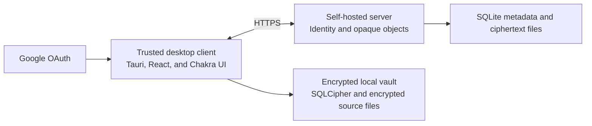

# Architecture

## System shape

Hemo Tracker is a local-first desktop application with an encrypted synchronization server.

The trusted desktop client owns all clinical behavior. It decrypts data, validates measurements, normalizes units, searches the account vault, and creates plots. The server authenticates accounts and stores opaque ciphertext.

## Technology baseline

The desktop client uses Tauri 2, React 19, TypeScript, Vite, Chakra UI, TanStack Query, Zod, and Bun tooling. The server uses TypeScript, tRPC, Zod, Drizzle, and SQLite. Tests use Vitest and Playwright.

Rust owns key operations, decrypted database access, source-file encryption, native credential storage, and other security-sensitive native functions. The webview does not receive raw encryption keys or SQL access.

The plot engine remains undecided. A benchmark will compare uPlot and Apache ECharts.

## Main modules

### Account vault module

The account vault module is the main client seam. Its interface exposes domain operations. It does not expose SQL, encryption keys, file paths, or cipher options.

It owns these behaviors:

- Lab report storage.
- Measurement storage and validation.
- Analyte definition storage.
- Personal target range storage.
- Encrypted source-file storage.
- Search and filtering.
- Export and backup.
- Entity versions for synchronization.

A SQLCipher adapter implements local storage. Tests use an in-memory adapter only when it exercises the same interface rules.

### Key module

The key module creates and unwraps account, device, database, and source-file keys. It owns versioned key envelopes, recovery, passphrase change, random values, and domain separation.

Candidate tools include RustCrypto Argon2id, XChaCha20-Poly1305, `getrandom`, and `zeroize`. The security proof must select exact formats and parameters before an ADR accepts them.

### Normalization module

The normalization module receives a source measurement and an analyte definition. It returns one of three results:

- A safe normalized value.
- A value that needs a reviewed analyte-specific rule.
- A blocked conversion with a reason.

It uses UCUM for commensurable units. It never changes source facts.

### Trend module

The trend module builds display-ready series. It selects comparable measurements, calculates range segments, adds personal target ranges, and marks comparability boundaries.

The plot adapter receives engine-neutral points, intervals, boundaries, and theme tokens. Feature code must not use uPlot or ECharts option objects.

### Synchronization module

The synchronization module transfers encrypted objects and manifests. It compares entity versions. It preserves both versions when the same entity changed on two devices.

The module does not inspect clinical content on the server. The trusted client resolves conflicts.

### Identity module

The identity module uses Google OAuth Authorization Code with PKCE. The desktop client uses the system browser and a temporary loopback callback. The server checks the Google identity against its email whitelist.

Identity grants access to account ciphertext. It does not decrypt the account vault.

## Data ownership

One account owns these encrypted entities:

- Trusted devices.
- Lab reports.
- Source-file manifests.
- Measurements.
- Analyte definitions.
- Personal target ranges.
- User settings.
- Synchronization conflicts.

The server can read only the minimum operations metadata. This data includes the account email, account state, quota, used ciphertext storage, device count, opaque object identifiers, ciphertext sizes, and timestamps.

## Source and derived data

Source data includes source files, source value text, source unit text, source reference intervals, source flags, source labels, and report metadata.

Derived data includes parsed numeric values, normalized values, comparability decisions, plot series, and overview summaries.

The application can recalculate derived data when an analyte definition changes. It must not change source data during recalculation.

## Local and server storage

The client uses an encrypted local SQLite vault. It encrypts each source file before it writes the file to persistent storage. It stores a small device-unlock key in Apple Keychain or Windows Credential Locker after explicit approval.

The server uses SQLite for account and opaque object metadata. It stores encrypted object bodies on a mounted filesystem behind a small object-storage interface. A future S3-compatible adapter can implement the same interface.

## Synchronization

Each synchronized entity has an opaque identifier and a version. The client sends only encrypted entity content and permitted operations metadata.

If two devices change different entities, synchronization applies both changes. If two devices change the same entity version, the server keeps both encrypted candidates. A trusted client asks the user to select one candidate.

## Deployment

Docker Compose deploys the server and its persistent volumes. Production access uses HTTPS. Plain HTTP is permitted only on `localhost` during development.

The server needs Google OAuth configuration. The user supplies secrets during deployment. Secrets must not enter repository files, documentation examples, logs, or backups.

The release system signs and notarizes macOS builds. It signs Windows builds and Tauri update artifacts. The release signing keys stay outside the data server.

## Security verification

The project must complete these proofs before it stores real medical data:

- Key creation, wrapping, recovery, passphrase change, and rotation.
- Native credential storage on signed macOS and Windows builds.
- SQLCipher files, journals, temporary files, backups, and crash behavior.
- Streaming encryption for large source files.
- Google OAuth PKCE callback and token validation.
- Signed application and update rejection tests.
- Log, telemetry, crash-report, clipboard, export, and screenshot review.

An independent specialist must review the threat model, key hierarchy, encrypted formats, native storage, OAuth flow, Tauri capabilities, and release-key custody.
