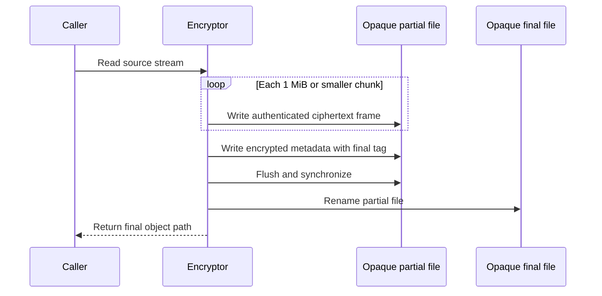

# Streaming source-file encryption proof

Date: 2026-08-27

Status: Proposed input for the security ADR

## Purpose

This proof tests bounded-memory encryption for source files. It uses libsodium XChaCha20-Poly1305 secretstream through `libsodium-rs` 0.2.4 and `libsodium-sys-stable` 1.24.0. The native binding bundles libsodium 1.0.22.

## Format

Version 1 has this byte order:

| Field | Size | Meaning |
| --- | --- | --- |
| Magic | 8 bytes | `HEMOSRC` plus one zero byte |
| Version | 1 byte | Value 1 |
| Secretstream header | 24 bytes | Libsodium stream header |
| Data frames | Variable | Encrypted 1 MiB or smaller plaintext chunks |
| Metadata frame | Variable | Encrypted final metadata |

Each frame has a one-byte type, a four-byte big-endian ciphertext length, and one secretstream ciphertext message. A data frame requires the secretstream message tag. The metadata frame requires the final tag. The decryptor rejects a missing final frame, an early final frame, an unknown type, an invalid length, or any bytes after the final frame.

The frame header is not secret. Secretstream authenticates its value through additional data. The additional data also binds the format version, account identifier, opaque object identifier, and frame index.

The final encrypted metadata is JSON. It contains the original filename, media type, SHA-256 checksum, and plaintext byte count. The opaque object identifier is a random 256-bit lowercase hexadecimal value. Its type rejects every other value before path construction. The storage file name is `<opaque object identifier>.hemo`. It does not contain the original filename.

## Key rule

The key module supplies an account source-file purpose key. HKDF-SHA-256 derives a separate 256-bit file key for each opaque object identifier. The derivation binds the account identifier, format version, and object identifier.

The file key exists only in the trusted Rust process. The webview and server must not receive it.

## Write sequence

This sequence shows why interrupted encryption leaves no plaintext or accepted partial ciphertext.



An error removes the partial ciphertext. A process stop can leave one opaque `.partial` ciphertext file. Startup maintenance can remove this uncommitted file. The encryptor never creates a plaintext temporary file and never accepts the partial file as a final object.

## Proof results

The normal suite proves these behaviors:

- Source bytes and metadata round-trip correctly.
- Source bytes, original filename, and media type do not occur in ciphertext.
- Account, object, and version changes cause rejection.
- Changed, truncated, reordered, and duplicated frames cause rejection.
- Separate opaque object identifiers produce separate file keys.
- A planned source-read failure removes the partial ciphertext.
- A subprocess stop during encryption leaves no final object. Its remaining partial file contains only ciphertext and no source marker.

The release-mode large-stream test encrypts and decrypts 2 GiB plus one byte. It completed with a 1 MiB plaintext buffer, one frame buffer, generated input, and a counting output sink. It created no plaintext fixture.

Run the normal proof:

```sh
cargo test --locked --manifest-path proofs/source-file-encryption/Cargo.toml
```

Run the explicit large-stream proof:

```sh
cargo test --release --locked --manifest-path proofs/source-file-encryption/Cargo.toml multi_gigabyte_stream_has_bounded_buffers -- --ignored --exact
```

## Decryption rule

Decryption writes verified chunks to a caller-supplied stream. A later frame can still fail. The caller must discard all earlier output when decryption returns an error.

The application must not decrypt to an internal persistent temporary file. A user-selected export can use a partial output path, but the application must remove that output after any error.

## Limits

The proof does not provide random file access or resume an interrupted stream. It does not hide ciphertext length or 1 MiB frame boundaries. It does not protect plaintext that the user exports or another program reads.

The security ADR must decide whether V1 needs periodic explicit rekey tags, a maximum source-file size, and a durable directory-synchronization step after rename. An independent security review must approve the container and native dependency chain.
