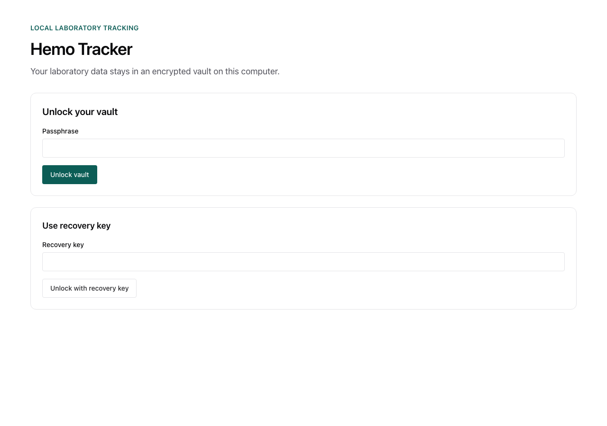
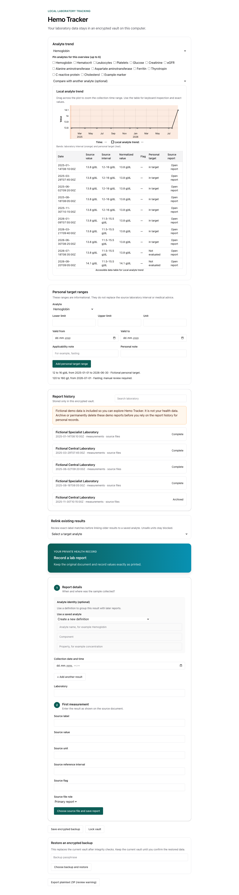

# User documentation

This directory contains the V1 user guides. Issue 26 adds the procedures and current product screenshots after the related product workflows are complete.

Start with the [project README](../../README.md) until the V1 quickstart is available.

Use the [macOS installation guide](install-macos.md) or [Windows installation guide](install-windows.md) for unsigned builds.

## Hemo Tracker user guide

Hemo Tracker stores laboratory reports in an encrypted local vault. It does not give medical advice.

## Quick start

1. Start Hemo Tracker.
2. Select **Create your local vault**.
3. Enter and confirm a strong passphrase.
4. Store the recovery key in a separate safe place.
5. Select **I stored the recovery key**.
6. Enter the report collection date and time.
7. Select a source-file role and choose the original report file.
8. Select a saved analyte, or enter a new analyte identity.
9. Enter the source label, value, unit, interval, and flag.
10. Select **Choose source file and save report**.

Result: The report is stored in the encrypted local vault. The original source file is not changed.

## Correct a measurement

Use the correction action for a value that was entered incorrectly. Review the source file before you confirm the correction.

The correction changes the current value. The source file remains immutable. Hemo Tracker records the update time and local user identity.

## Find a report

Use **Report history** after you unlock the vault. Enter a laboratory name in **Search reports** to filter the list. The list shows the collection time and report state.

## Save an encrypted backup

1. Unlock the local vault.
2. Select **Save encrypted backup**.
3. Select a destination in the native save dialog.
4. Store the backup separately from the computer.

Hemo Tracker encrypts the backup. The backup does not contain the passphrase or recovery key. Keep the backup and recovery material separate.

## Read a trend

1. Select an analyte in **Analyte trend**.
2. Review the plot for recorded numeric values.
3. Read the data table below the plot when you need exact values.

The table also shows missing and flagged results. A plot does not give medical advice. Results with different units are not comparable until Hemo Tracker confirms a safe normalization rule.

Hemo Tracker uses the analyte canonical unit for a connected trend. It excludes a result when the value is not numeric or the unit is invalid or incompatible. The interface shows the number of excluded results. The source report keeps the original value and unit.

Select **Compare with another analyte** to show a second local series. Use the source units and flags to check that the two series are meaningful to compare. Hemo Tracker does not convert incompatible units.

## Add a personal target range

Use a personal target range only as personal information. It does not replace the interval from the source laboratory. It is not medical advice.

1. Select an analyte in **Personal target ranges**.
2. Enter a lower limit, an upper limit, or both limits.
3. Enter the unit.
4. If necessary, enter the start date and end date.
5. If necessary, enter an applicability note or a personal note.
6. Select **Add personal target range**.

Result: Hemo Tracker adds the range to the analyte. Existing measurements and source reference intervals do not change. You can add more ranges for other dates, units, or contexts.

## Safety limits

Hemo Tracker is a record-keeping tool. It does not diagnose conditions or give medical advice. Check laboratory results with a qualified health professional.

The unsigned V1 application is intended for local use. Keep the device, passphrase, recovery key, backups, and exported files secure. A decrypted export is a plaintext copy. The operating system can show an unverified-publisher warning for an unsigned build. Do not disable global operating-system protections.
